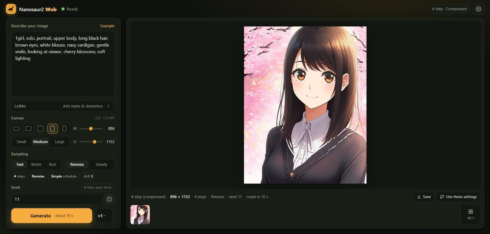

# Nanosaur2 Web

Runs [Nanosaur2-670M](https://huggingface.co/well9472/Nanosaur2-670M), a small illustration
text-to-image diffusion transformer, **entirely in the browser** on WebGPU. The model files are
downloaded once, cached in the browser's Origin Private File System, and every later visit
starts straight from the cache. Prompts and images never leave the page.

There is no ONNX/runtime dependency. The inference engine is a small set of hand-written WGSL
kernels (`app/gpu/`) that run the bf16 or int8 weights directly.



- Both released models: **4-step** (default; distilled, no guidance, an image in about 10 s) and
  **Normal** (guidance with a negative prompt, 30–50 steps)
- Two download sizes for the image model: **Compressed** (int8, 0.7 GB, nearly identical images;
  1.3 GB in all for the 4-step model) and **Original** (the model repo's bf16 file, 1.3 GB)
- Prompt emphasis with `(text:1.3)`, as in the ComfyUI nodes
- Numerically checked against an independent PyTorch implementation, which is itself checked
  against the upstream ComfyUI node code
- LoRAs from Hugging Face or disk, applied as a runtime low-rank path (no weight merging)
- Live previews, a generation queue, seeds that match ComfyUI's initial noise, and a session gallery
- Runs in a Web Worker; resumable downloads; no server beyond static hosting

## Quick start

The app is static files (`index.html` and `app/`), so any static host works. Pushing to `main`
publishes them to GitHub Pages through `.github/workflows/pages.yml`.

```bash
python tools/serve.py                 # http://127.0.0.1:8080/ (any static server works)
```

Open the page in a WebGPU browser (recent Chrome or Edge), pick a model and download size and
press **Download & start**. The first visit downloads 1.3 GB (4-step, Compressed) or 2.0 GB
(4-step, Original); the second model adds 0.7 / 1.3 GB. After that the app loads from the
browser's cache.

## The models

| | 4-step (default) | Normal |
|---|---|---|
| file | `nanosaur2_dmad_4step_diffusion_model.safetensors` | `nanosaur2_diffusion_model.safetensors` |
| sampling | Renoise (ComfyUI `lcm`), 4 steps, CFG 1 | Euler, 30–50 steps, CFG 4 |
| negative prompt | no (one DiT pass per step) | yes |
| 832×1216 on a mid-range laptop GPU | **~10 s** | ~95 s (30 steps) |

Both share the Gemma3-270M text encoder (`nanosaur2_text_encoder.safetensors`, 0.54 GB, from the
model repo) and the VAE decoder (79 MB, see below). Settings follow the model card and the example
workflows in the model repo: shift 3 and the "simple" schedule (the card also recommends starting
prompts with "newest, masterpiece"). The Normal model uses the card's recommended *alternate*
guidance: classifier-free guidance on even steps and SPRINT path-drop guidance on odd steps,
where the unconditional pass skips the 14 sparse middle blocks. The *negative pass* chip switches
to full CFG or path drop on every step.

`MODELS_URL` in `app/main.js` points at the model repo **pinned to a commit**, so files can't
change under cached copies. `BUILDS_URL` points at the built files, hosted at
[sm079/nanosaur2-web](https://huggingface.co/sm079/nanosaur2-web), also pinned to a commit. `?models=<url>` loads
everything from one place, e.g. `?models=./models/` for local copies (any other host must allow
CORS and should support Range requests).

## Built files

`tools/build_assets.py` writes the hosted files next to the originals in `models/`:

| file | size | contents |
|---|---|---|
| `nanosaur2_dmad_4step_diffusion_model.int8.safetensors` | 689 MiB | DiT, block linears int8 |
| `nanosaur2_diffusion_model.int8.safetensors` | 689 MiB | DiT, block linears int8 |
| `nanosaur2_vae_decoder.safetensors` | 79 MiB | the VAE's decoder half, unchanged (the DINOv2 encoder is only for image-to-latent) |

The attention and MLP linears of all 18 blocks and both text refine blocks use ComfyUI's
`int8_tensorwise` + ConvRot format, as in anima-studio: each weight row is rotated by a 256-point
Hadamard matrix per group of 256 inputs, then quantized with one scale per output channel. At
runtime the GEMM decodes the int8 weights in its tile loader and the activations get the same
rotation. adaLN, embedders, final layer and norms stay bf16. The text encoder is used as released.

Fidelity (`tools/measure_quality.py`: 3 prompts, fixed seeds, 768², default sampling; PSNR of
the final image against the all-bf16 output):

| | 4-step | Normal (30 steps, CFG 4) |
|---|---|---|
| int8 DiT | 28.7 dB | 29.6 dB |

Diffusion amplifies small weight differences into changed details, so visually equivalent images
score far below "lossless" PSNR (for comparison, Anima's int8 build scores ~20 dB). Compressed
images keep the original's composition, colors and details. Quantization reduces download size
and graphics memory, not time: the engine computes in fp32 either way (1.73 s per DiT pass at
832×1216 for both).

## How it maps onto the model

| part | implementation |
|---|---|
| Tokenizer | Gemma3 SentencePiece BPE in JS (`app/tokenizer.js`), reading the `spiece_model` tensor stored in the text encoder file. `(text:weight)` parsing as in `nanosaur2_support/text_encoder.py`; ids and weights match Python `sentencepiece` on a 432-prompt corpus (CJK, emoji, byte fallback, whitespace runs). |
| Text encoder | Gemma3-270M: the hidden state after layer 17 of 18, with the final norm. GQA 4/1, head dim 256, q/k norm, sandwich norms, GELU(tanh) MLP, local/global RoPE (1e4 / 1e6). Embedding rows are read from the cached file on demand, so the 335 MB table never goes to the GPU. |
| DiT | 18 blocks, dim 1536, 16 heads of 96, one token per latent pixel (64 channels at 1/16 scale). adaLN-single (shared projection + per-block offsets), 2 timestep-conditioned text refine blocks, 2D RoPE over centered coordinates, joint image+text attention on even blocks with log prompt weights as key biases, SwiGLU, SPRINT residual sparse path (blocks 2–15), x-prediction. |
| Sampling | Flow matching, shift 3. Renoise/LCM, Euler, Euler A, DPM++ 2M; "simple" and "beta" schedules. |
| Preview | Each step's x0 prediction projected to RGB with a linear map fitted by `tools/fit_preview.py` (the latents are DINOv2 features, so previews are approximate). |
| Noise | Port of `torch.randn` on the CPU generator, so seeds give ComfyUI's initial noise. The renoise noise comes from a second CPU generator seeded the same way (ComfyUI on CUDA draws it from the GPU generator, so 4-step images match ComfyUI-on-CPU rather than ComfyUI-on-GPU). |
| VAE | The convolutional decoder of the semantic DINOv2 VAE: GroupNorm resblocks, attention at latent resolution, 4 nearest-neighbour upsamplings, tanh. NHWC implicit-GEMM convs with a fused 2x upsample; the DINOv2 encoder in the same file is never loaded. |

Engine layout:

- `app/gpu/gemm.js`: the tiled GEMM generator (bf16 weights decoded in the tile loader, strided
  and batched f32 for attention, implicit im2col for convs, fused bias / SiLU / gated-residual
  epilogues).
- `app/gpu/kernels.js`: fused flash attention (online softmax; head size 64/96/128, optional
  per-key bias), norms with adaLN modulation, per-head norm + RoPE, GLU, GroupNorm.
- `app/models/`: Gemma3, the Nanosaur2 DiT and the VAE decoder.
- `app/worker.js`, `app/engine.js`: the engine runs in a Web Worker so the page stays responsive;
  it falls back to the page if a browser lacks WebGPU in workers (`?engine=page` forces it).
- `app/pipeline.js`, `app/samplers.js`, `app/store.js`: orchestration, samplers, and the
  resumable OPFS download cache.

## LoRAs

Paste a Hugging Face link to a LoRA's `.safetensors` file (its `/blob/` page or `/resolve/`
download link) in the **LoRAs** view, or add a file from disk. Before downloading, the app reads
just the file's header (a Range request) to check that it's a LoRA whose layer names match
Nanosaur2, and reads the repo card for a preview image and trigger words. Each LoRA has a strength
slider (−1 to 2; double-click resets to 1), an on/off toggle (click the thumbnail) and a link to
its page. [Nanosaur2 LoRAs on Hugging Face](https://huggingface.co/models?other=base_model:adapter:well9472/Nanosaur2-670M).

Supported: PEFT naming (`diffusion_model.<module>.lora_A/B.weight` + `.alpha`, as written by the
model repo's `train_lora.py`) and kohya naming (`lora_unet_…` / `lora_te_…` with
`lora_down/up` + `alpha`), for the DiT (including text refine blocks) and the text encoder.
LoKr/LoHa/DoRA are reported as unsupported.

LoRAs are not merged: each targeted linear gets a side path `y = W·x + s·B(A·x)` added in the
GEMM epilogue, so strength changes are instant. Checked against the PyTorch reference with the
LoRAs merged into the weights (two synthetic LoRAs at once, PEFT for 85 DiT modules and kohya
for 9 text encoder modules; they change the text encoder output by 15%): text encoder rel. error
2.5e-6, DiT output 1.2e-5, 4-step final latent 1.0e-4. On int8 layers `A` is pre-rotated (`A·H`)
so it takes the same rotated input; with the int8 DiT: 2.5e-6, 1.4e-5 and 7.8e-5.

A Hugging Face access token (read-only is enough) is optional. It can be entered on the first-run
screen or in **Settings**; it is used for model downloads (signed-in downloads get higher limits)
and for gated or private LoRA repos. It is stored only in the browser and sent only to
huggingface.co.

## Verifying the engine

`tools/reference.py` is an independent fp32 PyTorch implementation that reads the same model
files (put copies in `models/`). It produces an image and dumps intermediate tensors;
`tools/check.html` runs the WebGPU engine on the same inputs and compares:

```bash
pip install torch safetensors sentencepiece pillow
python tools/reference.py --model 4step --dump out/dump4
python tools/reference.py --model base --steps 4 --dump out/dumpbase
python tools/build_assets.py && python tools/reference.py --precision int8 --dump out/dump4i8
python tools/serve.py   # then open http://127.0.0.1:8080/tools/check.html?dump=../out/dump4/
```

The reference itself matches the upstream ComfyUI node code (`nanosaur2_support`, run in fp32)
to 1.3e-6 (text encoder), 1–4e-6 (both DiTs, with and without path drop) and 1.7e-7 (VAE).
WebGPU engine vs reference at 832×1216, relative L2 error:

| stage | 4-step bf16 | 4-step int8 | Normal bf16 (CFG 4, alternate) | Normal int8 |
|---|---|---|---|---|
| text encoder hidden states | 2.3e-6 | 2.3e-6 | | |
| DiT x0, conditional | 1.0e-5 | 1.2e-5 | 3.2e-6 | 3.6e-6 |
| DiT x0, unconditional (full / path drop) | | | 4.0e-6 / 3.3e-6 | 3.3e-6 / 3.0e-6 |
| final latent, whole sampling loop | 4.4e-5 | 7.3e-5 | 3.4e-5 (4 steps) | 1.5e-5 (4 steps) |
| decoded image (8-bit rounding) | 1.7e-3 | 1.7e-3 | | |

The int8 columns compare against the reference running the same int8 DiT (dequantized).

## Performance and requirements

- A WebGPU browser and a GPU with about 4.5 GB free at 1024²: bf16 weights ~1.6 GB plus up to
  2.9 GB of working memory (measured; the VAE decode at full resolution is the peak). Smaller
  canvases need less.
- Mid-range laptop GPU, 832×1216: one DiT pass 1.7 s, VAE decode 1.4 s. A path-drop pass runs 4 of
  18 blocks (~0.4 s). Shaders compile on the first image, which takes a few seconds longer.
- On laptops with two GPUs the browser may pick the integrated one, which is several times slower.
  Windows: Settings → System → Display → Graphics, set the browser to "High performance".
- Persistent storage: the app calls `navigator.storage.persist()` so the browser does not evict
  the cached weights.

## License

Nanosaur2 is MIT-licensed by its author; see the [model card](https://huggingface.co/well9472/Nanosaur2-670M).
The app downloads the original model files from that repo.
